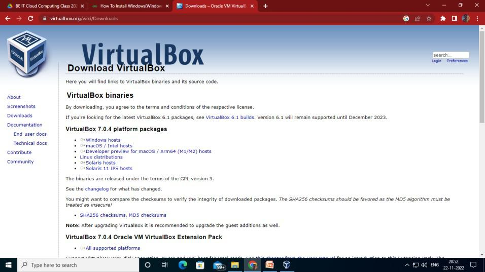

# walkthrough-for-Windows-Virtual-Machine
<h1>How to Install Windows 10 on Virtual Box</h1>

Virtual Box is kind of a hypervisor that provides us with an environment to run multiple virtual operating systems like Windows, Linux, etc at the same time. A virtual operating system provides us free to use the operating system free of cost to test our newly created software before running it on our actual operating system. If not for virtualization, we would have been required to buy a new computer to run a new operating system which would have been costly. But with virtualization, we can run multiple operating systems on the same machine. Here we will try to run a Windows 10 operating system on our Virtual Box as a guest machine.  

<strong>Step 1: Downloading Virtual Box</strong>

Download Virtual box from here. Select your host according to your operating system. For example, people having Windows Host will select Windows hosts from the link given below. For further reference, the installation of virtual box on windows can be understood.

 
 

<strong>Step 2: Downloading Windows 10 ISO File.
</strong> 

After setting up your Virtual Box, Search Microsoft Windows Evaluation 10 and download Windows 10 ISO file from microsoft.com (free trial only available for 90 days). Then fill up all the requirements and click on Continue to download it. Note that you have to register before moving to the ISO file download page as shown below.

 
 
After the download has been completed, it will be stored in your Downloads folder on This Computer.

<strong>Step 3: Installation of Windows 10 in Virtual Box.</strong>

Start the installation of the Windows 10 operating system. Select a name, then the type as MS Windows and the version as Windows 10(64-bit) with respect to the machine used. Then provide memory according to our RAM size preferably 2-4GB and then leave the Hard disk file type as VDI, then select the virtual hard disk size, and you are done as shown below

Then provide memory according to our RAM size preferably 2-4GB. We have selected here 1GB which is 1024MB for demonstration purposes but on your computer, we would prefer to allocate at least 2048MB of memory.
 
 
Then leave the Hard disk file type as VDI.
 
 
Then select the virtual hard disk size. We selected here 50GB. You can select according to your CPU space available.
 
 
Step 4: Sharing the Location of the ISO File of Windows 10.
Go to Settings->Storage->Click on “Empty” under “Controller” choose the CD icon and then click on “choose a disk file”. Browse to the location where you have downloaded the Windows 10 ISO file. Copy the location and paste it.
Once this is done, other settings can be changed also or can be kept default.
 
 
Browse to the location where you have downloaded the Windows 10 ISO file and select it so that Windows 10 gets installed on VirtualBox.
 
 
Step 5: Running Windows on Virtual Box
That is Windows 10 has been installed on the Virtual Machine. You can now open the Windows 10 operating system in VM. Set up a new username and password and use Windows 10 in VM for various purposes.
 
# walkthrough-for-Windows-Virtual-Machine
